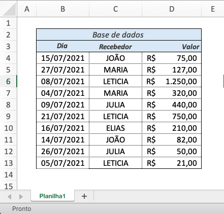
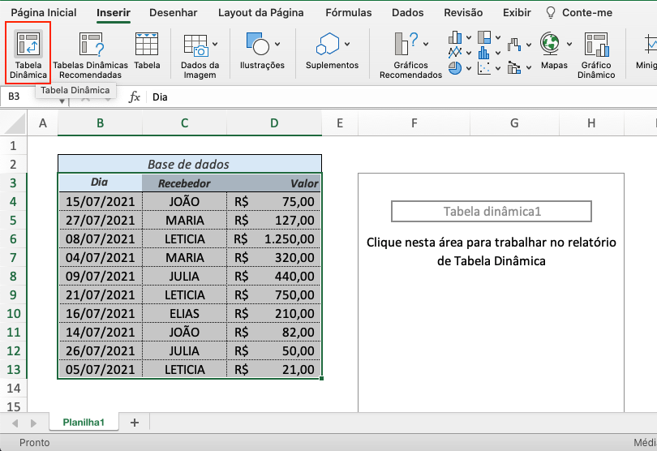
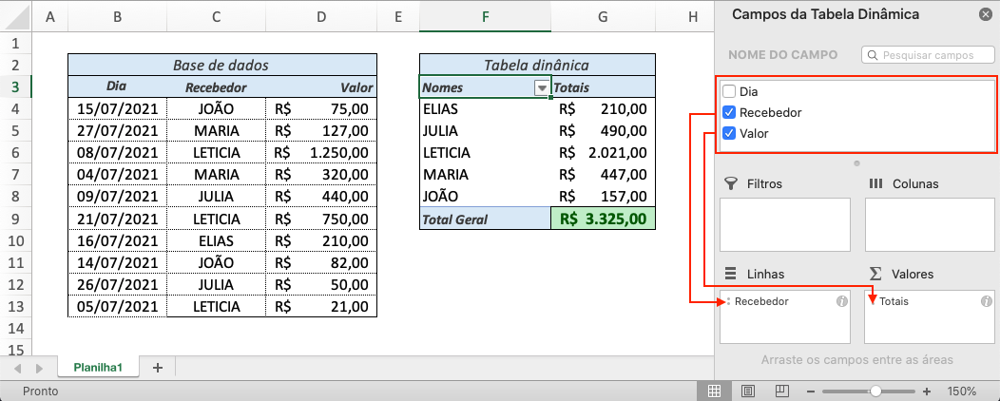

# excel-tabela-dinamica

Esse projeto faz parte de um estudo mais aprofundado sobre excel, tendo como único objetivo detalhar os passos necessários da tabela dinâmica, a fim de servir como uma base de conhecimento para consultas futuras e outros usuários da comunidade.

## Estratégias abordadas:

- Tabela dinâmica;

## Execução

### 1 - Definição da base de dados

Para que seja possível trabalhar com tabela dinâmica, é necessário que haja uma fonte de dados. O objetivo com a tabela dinâmica é organizar a fonte de dados, de tal forma que seja possível filtrá-la para obter um resultado que nos permita tomar uma decisão em relação a esses dados, como por exemplo uma conciliação financeira, apuração comissional, apuração de estoque de produtos e etc.

Abaixo foi criada uma base de dados simples, que nos permite exemplificar essa idéia, com alguns indivíduos que devem receber um determinado valor, podendo esses valores, se repetirem em dias ou lançamentos diferentes.

### 2 - Criação da tabela dinâmica

### 3 - Populando a tabela dinâmica

## Conclusão